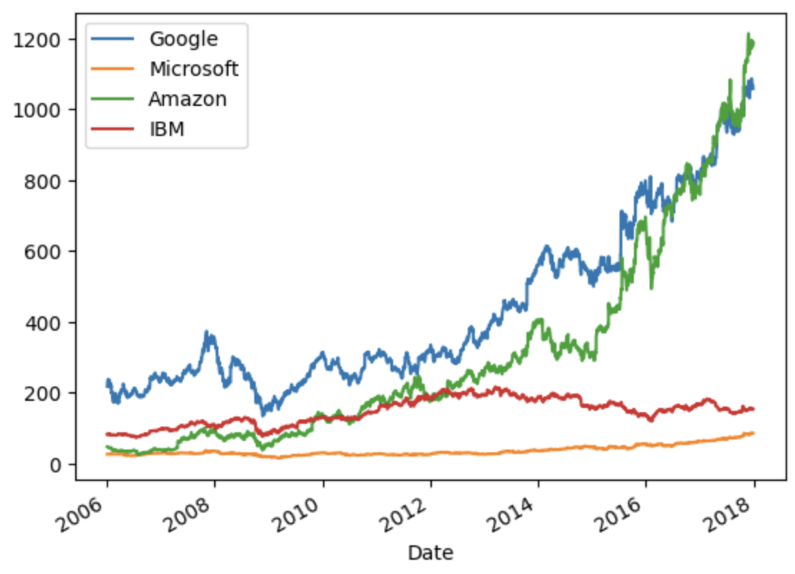
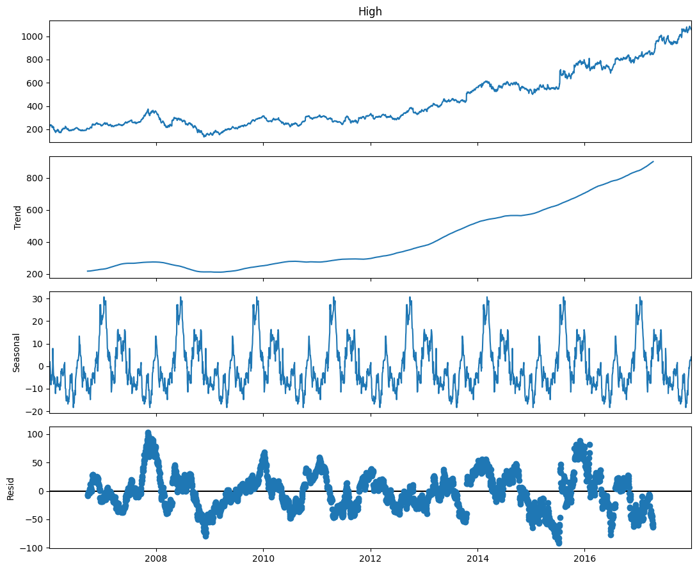
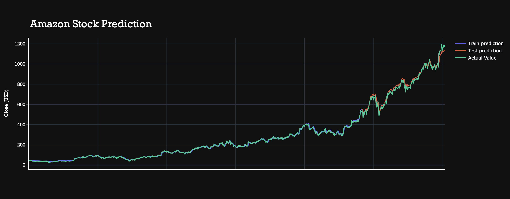

# 📈 Stock Market Analysis and Forecasting Using Deep Learning (GRU)

## 📑 Project Overview

This project focuses on analyzing and forecasting stock prices for major technology companies using deep learning techniques, specifically **Gated Recurrent Units (GRU)** implemented in **PyTorch**.

We performed **Exploratory Data Analysis (EDA)** and built a GRU-based time series forecasting model to predict future stock prices.

### Companies Analyzed:

- Google (GOOG)
- Microsoft (MSFT)
- IBM
- Amazon (AMZN)

---

## 📊 Dataset

The dataset contains historical daily stock price data for the selected companies, with the following features:

- Open
- High
- Low
- Close
- Volume

---

## 📈 Data Analysis Highlights

- **Microsoft:**  
  Displayed a slow, steady upward trend in the "High" price over the years.

- **IBM:**  
  Experienced multiple downturns, with significant drops around 2013, 2016, and 2017.

- **Amazon:**  
  After a minor dip in 2009, Amazon's stock price showed exponential growth post-2012, eventually surpassing Google.

- **Google:**  
  Maintained steady growth with strong upward movement after 2012.

> All four companies saw noticeable price dips during 2009, likely due to the global economic slowdown.

---

## 🕑 Time Series Forecasting Approach

We applied time series forecasting techniques to model and predict future stock prices based on historical data patterns like **trend**, **seasonality**, and **cyclic variations**.

---

## 🧠 GRU Model (Gated Recurrent Unit)

The forecasting model is built using a **GRU (Gated Recurrent Unit)**, a variant of Recurrent Neural Networks optimized for sequential data.

**Why GRU?**

- Simpler architecture than LSTM
- Faster training with fewer parameters
- Effective at capturing temporal dependencies in time series data

### GRU Architecture Overview:

- **Reset Gate:** Controls how much past information to forget.
- **Update Gate:** Decides how much new information to incorporate.

---

## 📈 Results

Below are sample output plots showing **actual vs predicted stock prices** for different companies:

---

## ✅ Conclusion

This project demonstrates how **deep learning models like GRU** can be effectively applied to **financial time series forecasting**, providing valuable insights for stock price trend analysis and prediction.

---

## ⭐ Thank You!

Contact m.adyasa@iitg.ac.in for any further queries.

